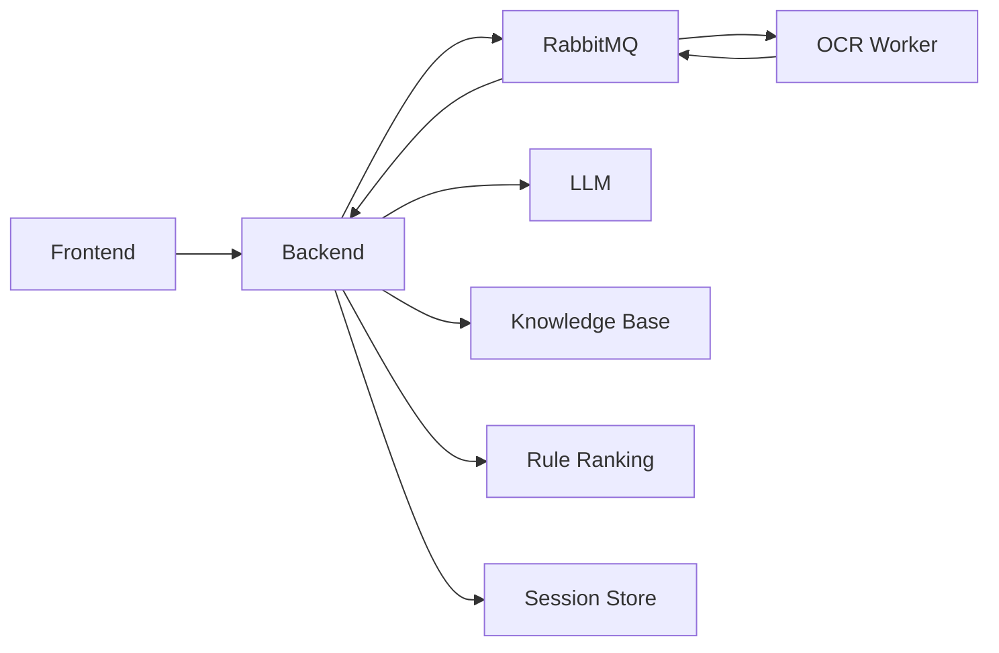

# Arena Agent

Kards 竞技场三选一辅助系统。

这个仓库把竞技场截图上传、OCR 识别、知识增强分析、规则兜底推荐、会话状态维护和前端确认选牌串成了一条完整链路，适合本地联调、功能演示和继续迭代。

## 仓库结构

```text
my-arena-agent/
├── frontend/      # Vue 3 + Vite 前端工作台
├── backend/       # Spring Boot 决策服务
└── ocr-service/   # FastAPI OCR 识别服务
```

## 当前能力

- 上传 Kards 竞技场截图并识别 3 张候选卡
- 用 `PaddleOCR + OpenCV + RapidFuzz` 将截图映射为标准卡牌对象
- 用 `LangChain4j Tool Calling + 规则排序 + 本地知识库` 输出推荐结果
- 维护整局 `session`、已选卡池、牌组状态和历史记录
- 在前端直接确认“这轮最终选了哪张牌”
- 支持 `RabbitMQ + OCR worker + 前端 WebSocket/轮询` 的异步识别链路
- 支持可选的 `Redis + Redisson` 会话存储与分布式锁
- 对重复截图分析做去重缓存，避免重复 OCR / LLM 调用

## 架构概览



默认情况下：

- `frontend` 运行在 `http://127.0.0.1:5173`
- `backend` 运行在 `http://127.0.0.1:8080`
- `ocr-service` 运行在 `http://127.0.0.1:18000`

## 快速开始

### 1. 准备环境

- Node.js 18+
- Java 17
- Python 3.10+
- DashScope 兼容 OpenAI API 的密钥
- RabbitMQ 3.12+
- 可选：Redis 7+

### 2. 启动 RabbitMQ

本项目的前端默认走异步分析链路，后端会把 OCR 任务投递到 RabbitMQ，`ocr-service` worker 消费后再把结果回传给后端。

```powershell
docker run --rm --name arena-rabbitmq `
  -p 5672:5672 -p 15672:15672 `
  rabbitmq:3-management
```

管理台地址：`http://127.0.0.1:15672`，默认账号密码都是 `guest`。

### 3. 启动 OCR 服务

在 `ocr-service` 目录：

```powershell
python -m venv .venv
.venv\Scripts\activate
pip install -r requirements.txt
pip install rapidfuzz paddleocr paddlepaddle
uvicorn app.main:app --host 127.0.0.1 --port 18000
```

说明：

- 当前仓库里的 `requirements.txt` 还是一个最小集合，首次运行还需要额外安装 `rapidfuzz`、`paddleocr` 和匹配版本的 `paddlepaddle`

如果要使用异步链路，还需要再开一个终端启动 OCR worker：

```powershell
cd ocr-service
.venv\Scripts\activate
python -m app.worker
```

### 4. 启动后端

在 `backend` 目录：

```powershell
$env:DASHSCOPE_API_KEY="your_api_key"
.\mvnw.cmd spring-boot:run
```

如果你要启用 Redis / Redisson：

```powershell
$env:DASHSCOPE_API_KEY="your_api_key"
$env:SPRING_PROFILES_ACTIVE="redis"
.\mvnw.cmd spring-boot:run
```

### 5. 启动前端

在 `frontend` 目录：

```powershell
npm install
npm run dev
```

前端开发服务器会把 `/api/*` 代理到 `http://127.0.0.1:8080`。

## 典型使用流程

1. 打开前端页面
2. 自动创建或恢复本地 session
3. 上传竞技场截图
4. 后端创建异步分析任务并投递 OCR 队列
5. OCR worker 识别完成后回传结果，后端生成推荐
6. 前端通过 WebSocket / 轮询展示候选卡、推荐结论、牌组状态和最近历史
7. 点击某张候选卡，确认本轮真实选择
8. 后端更新已选卡池、费用曲线和历史记录

## 组件说明

### `frontend`

- 单页工作台
- 负责截图上传、结果展示、选牌确认、会话恢复
- 详细说明见 `frontend/README.md`

### `backend`

- Spring Boot API 层
- 管理 session、工具调用、规则排序、知识检索、历史回写
- 支持 `in-memory` 与 `redis` 两种会话存储模式
- 详细说明见 `backend/README.md`

### `ocr-service`

- FastAPI OCR 服务
- 负责截图切分、OCR、文本归一化和模糊匹配
- 详细说明见 `ocr-service/README.md`

## 当前状态

这套系统已经能完成本地端到端联调，但仍然是偏研发验证形态，不是完全收口的生产版。

当前已知限制：

- OCR 服务依赖安装还不够一键化
- 部分旧测试用例已经落后于当前实现，`mvn test` 不是全绿
- 推荐质量依赖 OCR 识别质量、知识库内容和模型稳定性
- 目前仍是“手动上传截图”流程，不是桌面实时监听

## 建议阅读顺序

1. `README.md`
2. `backend/README.md`
3. `ocr-service/README.md`
4. `frontend/README.md`
