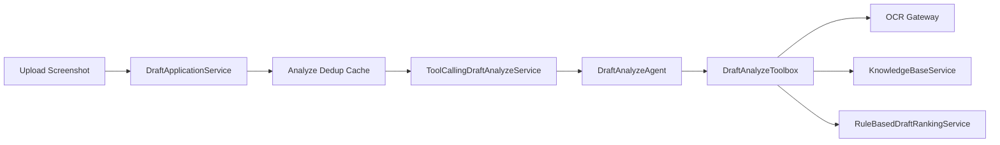
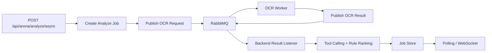

# Backend

`backend` 是 Kards 竞技场选牌系统的决策中枢。

它负责：

- 暴露 `REST API`
- 管理 draft 会话
- 调用 OCR 服务识别候选卡
- 用 `LangChain4j Tool Calling` 编排分析流程
- 用规则排序做主锚点和失败兜底
- 回写历史记录、已选卡池和牌组状态
- 可选地用 `Redis + Redisson` 提供会话存储、分析去重缓存和分布式锁
- 在异步链路下保存 job 状态，支持 OCR 结果监听并发和 LLM 并发保护
- 暴露 Actuator / Micrometer 指标，方便观察队列、LLM 和异步分析状态

## 技术栈

- Java 17
- Spring Boot 4
- RabbitMQ / Spring AMQP
- LangChain4j
- DashScope 兼容 OpenAI API
- Redis / Redisson

## 目录结构

```text
src/main/java/com/southwestasiafloat/backend
├── application
│   └── service
│       └── toolcalling
├── config
├── controller
├── domain
│   ├── gateway
│   ├── model
│   └── service
├── dto
└── infrastructure
    ├── cache
    ├── client
    ├── lock
    └── repository
```

## 核心能力

### 1. 会话管理

当前支持：

- `POST /api/arena/start`
- `GET /api/arena/session/{sessionId}`
- `POST /api/arena/pick`
- `DELETE /api/arena/session/{sessionId}`

`DraftSession` 中会维护：

- `currentPickNo`
- `pickedCards`
- `history`
- `deckState`

### 2. 分析链路

`POST /api/arena/analyze` 保留同步主流程：



现在还新增了异步 OCR 链路：



前端会先拿到 `jobId`，再通过：

- `GET /api/arena/analyze/jobs/{jobId}` 轮询状态
- `/ws/arena/analyze/{jobId}` 接收 WebSocket 推送

Agent 会按约定顺序调用工具：

1. `getSessionSnapshot`
2. `extractCandidates`
3. `evaluateBaseScores`
4. `analyzeDeckState`
5. `retrieveStrategyKnowledge`
6. `getPickHistory`
7. `rankCandidates`

最终输出推荐卡名、推荐理由、决策来源和分数。

### 3. 规则兜底

当前实现不是“纯 LLM 直接拍板”。

默认策略是：

- 候选卡基础分和局部牌组状态先做规则排序
- Tool Calling 结果以规则排序为主锚点
- LLM 主要负责解释、择优和打破接近分差的平局
- 如果 Agent 返回非法结果或调用失败，直接回退到规则排序结果

### 4. 轻量知识增强

当前知识增强不是向量数据库方案，而是本地 JSONL 知识库：

- `src/main/resources/knowledge-base/**/*.jsonl`

`KnowledgeBaseService` 会按：

- tag
- keyword
- collection

做轻量排序召回，再把结果通过工具交给 Agent 参考。

### 5. Redis / Redisson 集成

当前已经支持两种运行模式：

- `in-memory`
- `redis`

当启用 `redis` profile 时，后端会使用：

- `RedissonSessionRepository`
- `RedissonSessionLockManager`
- `RedissonAnalyzeResultCache`
- `RedissonAnalyzeRequestLockManager`
- `AnalyzeJobStore` 的 Redis 存储

覆盖以下能力：

- draft session 持久化
- 同一 session 的并发保护
- 重复截图分析结果缓存
- 同一分析 key 的并发去重
- 异步分析 job 状态在后端重启后可继续查询

### 6. 容灾与并发保护

异步 OCR 链路里，后端会把任务状态标记为：

- `QUEUED`
- `ANALYZING`
- `COMPLETED`
- `FAILED`

默认 `in-memory` 模式下，job 状态只保存在当前 JVM 内存中；启用 `redis` profile 后，job 状态会写入 Redis，TTL 由 `arena.ocr.async.job-ttl` 控制。

后端还有两层并发保护：

- OCR 结果监听器支持 `arena.ocr.async.result-listener-concurrency`，用于提高结果队列消费能力。
- LLM 调用通过 `arena.analysis.max-concurrent-llm-calls` 限制最大并发，避免外部模型接口被瞬间打满。
- 上传文件会校验为空、大小和基础 MIME 类型。
- 异步接口会限制全局 active job 数和单 session active job 数，系统繁忙时返回 `429`。

如果 LLM 并发许可等待超时、模型调用超时或熔断打开，当前分析会走已有的 rule-based fallback，保证用户仍能拿到推荐结果。

Redis 模式下，WebSocket job 更新会通过 Redis Pub/Sub 广播到其它后端实例；如果 WebSocket 推送没命中，前端仍可通过 `GET /api/arena/analyze/jobs/{jobId}` 轮询兜底。

### 7. 重复截图去重

`analyze` 当前会按：

- `sessionId`
- `currentPickNo`
- `screenshot SHA-256`

生成分析 key。

如果短时间内同一轮上传相同截图：

- 不会重复跑 OCR
- 不会重复调用 LLM
- 不会重复写入历史记录

## API 说明

### `POST /api/arena/start`

返回示例：

```json
{
  "sessionId": "b5d0d9b4-4e76-4f56-aef7-0c7e0e7f5f5d",
  "message": "Draft started successfully"
}
```

### `POST /api/arena/analyze`

请求格式：`multipart/form-data`

- `file`: 当前竞技场截图
- `sessionId`: 可选，建议总是传入

示例：

```bash
curl -X POST "http://127.0.0.1:8080/api/arena/analyze" \
  -F "file=@D:/screenshots/pick-01.png" \
  -F "sessionId=b5d0d9b4-4e76-4f56-aef7-0c7e0e7f5f5d"
```

响应结构：

```json
{
  "offeredCards": [
    {
      "name": "驱敌入海",
      "nation": "Japan",
      "cost": 3,
      "type": "order",
      "count": 1,
      "description": "移除1个单位。下个友方回合开始时，将其返回手牌。"
    }
  ],
  "decision": {
    "recommendedCard": {
      "card": {
        "name": "驱敌入海"
      },
      "baseScore": 3.5,
      "adjustedScore": 3.5,
      "count": 1,
      "source": "Japan.json",
      "matched": true,
      "comment": "基础质量优秀"
    },
    "llmReason": "规则排序领先，且当前牌组需要补足稳定解牌。",
    "decisionSource": "tool-calling-rag",
    "finalScore": 3.0
  }
}
```

### `POST /api/arena/analyze/async`

请求格式同同步接口：`multipart/form-data`

- `file`: 当前竞技场截图
- `sessionId`: 可选，建议总是传入

返回示例：

```json
{
  "jobId": "2e4d3c31-1dc6-48a7-9bd3-8d6619a1a30d",
  "status": "QUEUED",
  "message": "OCR job queued."
}
```

### `GET /api/arena/analyze/jobs/{jobId}`

返回示例：

```json
{
  "jobId": "2e4d3c31-1dc6-48a7-9bd3-8d6619a1a30d",
  "sessionId": "b5d0d9b4-4e76-4f56-aef7-0c7e0e7f5f5d",
  "status": "COMPLETED",
  "errorMessage": null,
  "result": {
    "offeredCards": [],
    "decision": null
  }
}
```

### `POST /api/arena/pick`

请求示例：

```json
{
  "sessionId": "b5d0d9b4-4e76-4f56-aef7-0c7e0e7f5f5d",
  "pickedCard": {
    "name": "驱敌入海",
    "nation": "Japan",
    "cost": 3,
    "type": "order",
    "count": 1,
    "description": "移除1个单位。下个友方回合开始时，将其返回手牌。"
  }
}
```

### `GET /api/arena/session/{sessionId}`

返回：

- 已选卡池
- 当前牌组状态
- 最近分析历史
- 当前手数

### `DELETE /api/arena/session/{sessionId}`

结束一局并删除该会话。

## 配置说明

主配置文件：

- `src/main/resources/application.yml`
- `src/main/resources/application-redis.yml`

### LLM 配置

```yaml
llm:
  api-key: ${DASHSCOPE_API_KEY}
  model-name: qwen3-max
  base-url: https://dashscope.aliyuncs.com/compatible-mode/v1
```

### OCR 配置

```yaml
ocr:
  base-url: http://127.0.0.1:18000
  path: /ocr
```

### RabbitMQ OCR 配置

```yaml
spring:
  rabbitmq:
    host: 127.0.0.1
    port: 5672
    username: guest
    password: guest

arena:
  ocr:
    async:
      exchange: arena.ocr
      request-queue: arena.ocr.requests
      retry-queue: arena.ocr.requests.retry
      dead-queue: arena.ocr.requests.dead
      result-queue: arena.ocr.results
      request-routing-key: ocr.request
      retry-routing-key: ocr.request.retry
      dead-routing-key: ocr.request.dead
      result-routing-key: ocr.result
      retry-delay: PT2S
      result-listener-concurrency: 2-8
      job-redis-map-name: arena:ocr:jobs
      job-ttl: PT2H
      job-recover-after: PT10M
      job-recovery-fixed-delay: PT1M
      job-update-topic-name: arena:ocr:job-updates
```

### Session / Redis 配置

```yaml
arena:
  session:
    store-type: in-memory
    ttl: PT12H
  analysis:
    cache-ttl: PT10M
    max-concurrent-llm-calls: 4
    llm-permit-timeout: PT20S
    llm-timeout: PT60S
    llm-max-retries: 1
    llm-circuit-breaker-failure-threshold: 5
    llm-circuit-breaker-open-duration: PT30S
    max-upload-size: 20MB
    max-active-jobs: 100
    max-active-jobs-per-session: 2
  redis:
    address: redis://127.0.0.1:6379
    database: 0
    lock-watchdog-timeout: PT30S

management:
  endpoints:
    web:
      exposure:
        include: health,info,metrics,prometheus
```

说明：

- 默认是 `in-memory`
- 当启用 `redis` profile 时，`arena.session.store-type` 会切成 `redis`
- Redis 模式会同时增强 session、分析缓存、分布式锁和异步 job 状态的容灾能力
- `max-concurrent-llm-calls` 建议根据模型服务限流和本机吞吐逐步调整，不建议一开始拉太高

### 指标

启用后端后可以访问：

- `GET /actuator/health`
- `GET /actuator/metrics`
- `GET /actuator/prometheus`

当前自定义指标包括：

- `arena.analyze.jobs.submitted`
- `arena.analyze.jobs.completed`
- `arena.analyze.jobs.failed`
- `arena.analyze.jobs.handle_ocr_result`
- `arena.ocr.results.ignored`
- `arena.llm.calls`
- `arena.llm.circuit.open`
- `arena.llm.circuit.tripped`
- `arena.analyze.fallbacks`

## 本地运行

### 普通模式

```powershell
$env:DASHSCOPE_API_KEY="your_api_key"
.\mvnw.cmd spring-boot:run
```

### Redis 模式

```powershell
$env:DASHSCOPE_API_KEY="your_api_key"
$env:SPRING_PROFILES_ACTIVE="redis"
.\mvnw.cmd spring-boot:run
```

默认服务地址：

- `http://127.0.0.1:8080`

## 测试与验证

主代码目前可以通过：

```powershell
.\mvnw.cmd -DskipTests compile
```

注意：

- 当前仓库里有一部分旧测试已经落后于实现，`.\mvnw.cmd test` 不是全绿
- 如果你要补完整回归，建议优先补：
  - Redis / Redisson 集成测试
  - 并发分析去重测试
  - session 生命周期测试

## 当前限制

- 知识增强目前是轻量检索，不是完整向量化 RAG
- 结果质量仍然依赖 OCR 和模型稳定性
- 未接入统一日志追踪、指标采集和效果评估面板
- 无 `sessionId` 时仍更适合单机本地开发场景

## 推荐阅读

- `application/service/DraftApplicationService.java`
- `application/service/toolcalling/ToolCallingDraftAnalyzeService.java`
- `application/service/toolcalling/DraftAnalyzeToolbox.java`
- `infrastructure/repository/RedissonSessionRepository.java`
- `infrastructure/lock/RedissonSessionLockManager.java`
