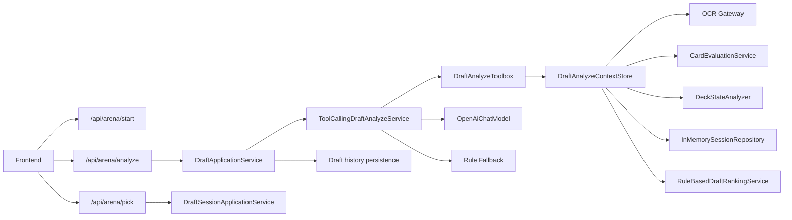

# Backend - Kards Arena Draft Agent

`backend` 是当前项目的后端决策服务，负责维护竞技场选牌会话、调用 OCR 服务识别候选卡牌，并在 `Tool Calling + 规则兜底` 的架构下返回推荐结果。

当前版本的重点不是“纯 LLM 直接拍结论”，而是：

- 用 `Spring Boot` 暴露稳定的 HTTP API
- 用 `DraftSession` 维护整局上下文
- 用 `LangChain4j Tool Calling` 编排分析流程
- 用规则排序作为主锚点和失败兜底
- 用历史记录把“推荐”和“实际选择”串成完整闭环

## 当前架构

### 角色分工

- `frontend`
  负责上传截图、展示候选卡、显示推荐结果、确认实际选牌。
- `backend`
  负责会话管理、分析编排、工具调用、推荐结果落库。
- `ocr-service`
  负责把截图识别成结构化候选卡牌列表。
- `DashScope / Qwen`
  负责在工具结果之上做最终解释和推荐输出。

### 核心调用链



### 分层说明

```text
src/main/java/com/southwestasiafloat/backend
├── controller
├── dto
├── application
│   └── service
│       └── toolcalling
├── domain
│   ├── gateway
│   ├── model
│   └── service
├── infrastructure
│   ├── client
│   └── repository
└── config
```

关键职责：

- `controller`
  对外提供 `/api/arena/*` 接口。
- `application.service`
  编排业务流程，连接 session、analyze、pick。
- `application.service.toolcalling`
  当前版本分析内核，负责 Agent、Toolbox、上下文缓存、规则兜底。
- `domain.model`
  定义 `Card`、`DraftSession`、`DraftHistoryEntry`、`DeckState`、`FinalDecision` 等核心对象。
- `domain.service`
  提供基础评分、卡组状态分析等确定性能力。
- `domain.gateway`
  抽象 OCR / LLM / repository 等外部依赖。
- `infrastructure`
  提供 OCR HTTP client、LLM client、内存 session 仓储等实现。

## 当前分析链路

`/api/arena/analyze` 已经重构为 `Tool Calling` 方式，但前端请求和响应结构保持不变。

### Analyze 内部流程

1. 前端上传截图，并可选携带 `sessionId`
2. `DraftApplicationService` 调用 `ToolCallingDraftAnalyzeService`
3. 服务为本次分析创建 `analysisId`，并把图片字节放入 `DraftAnalyzeContextStore`
4. `DraftAnalyzeAgent` 按约定顺序调用工具：
   - `getSessionSnapshot`
   - `extractCandidates`
   - `evaluateBaseScores`
   - `analyzeDeckState`
   - `getPickHistory`
   - `rankCandidates`
5. Agent 输出严格 JSON：
   - `recommendedCardName`
   - `reason`
   - `finalScore`
   - `decisionSource`
6. 后端校验推荐卡是否属于当前候选集
7. 如果 Tool Calling 失败或模型返回非法结果，则回退到 `RuleBasedDraftRankingService`
8. 返回 `DraftAnalyzeResponse`
9. 若本次分析带有 `sessionId`，则把结果写入 `DraftSession.history`，状态记为“待确认”

### 为什么这样设计

- 前端接口不变，重构风险低
- 工具负责提供事实，模型负责做有限度判断
- 规则排序可以降低幻觉和异常输出风险
- session 和 history 让整局选牌具备连续上下文

## Session 生命周期

### 1. 开始一局

`POST /api/arena/start`

- 创建 `DraftSession`
- 初始化 `currentPickNo = 1`
- 返回 `sessionId`

### 2. 分析当前一手

`POST /api/arena/analyze`

- OCR 识别候选卡
- Tool Calling 编排分析
- 返回推荐结果
- 将本轮记录写入 `history`

### 3. 用户确认实际选牌

`POST /api/arena/pick`

- 将 `pickedCard` 写入 `pickedCards`
- 更新 `deckState`
- 将最新一条历史记录从“待确认”改为“已确认”
- `currentPickNo + 1`

### 4. 查询当前局状态

`GET /api/arena/session/{sessionId}`

- 返回当前 session、已选卡池、历史记录、卡组状态

### 5. 结束本局

`DELETE /api/arena/session/{sessionId}`

- 删除内存中的当前会话

## 主要接口

### `POST /api/arena/start`

返回示例：

```json
{
  "sessionId": "b5d0d9b4-4e76-4f56-aef7-0c7e0e7f5f5d",
  "message": "Draft started successfully"
}
```

### `POST /api/arena/analyze`

请求格式：`multipart/form-data`

- `file`: 当前竞技场截图
- `sessionId`: 可选，会话存在时建议传入

`curl` 示例：

```bash
curl -X POST "http://127.0.0.1:8080/api/arena/analyze" \
  -F "file=@D:/screenshots/pick-01.png" \
  -F "sessionId=b5d0d9b4-4e76-4f56-aef7-0c7e0e7f5f5d"
```

响应示例：

```json
{
  "offeredCards": [
    {
      "name": "驱敌入海",
      "nation": "Japan",
      "cost": 3,
      "type": "order",
      "count": 1,
      "description": "移除1个单位。下个友方回合开始时，将其返回手牌。"
    }
  ],
  "decision": {
    "recommendedCard": {
      "card": {
        "name": "驱敌入海"
      },
      "baseScore": 3.5,
      "adjustedScore": 3.5,
      "count": 1,
      "source": "Japan.json",
      "matched": true,
      "comment": "基础质量优秀"
    },
    "llmReason": "规则排序领先，且当前牌池需要补充稳定解牌。",
    "decisionSource": "tool-calling",
    "finalScore": 3.0
  }
}
```

### `POST /api/arena/pick`

请求示例：

```json
{
  "sessionId": "b5d0d9b4-4e76-4f56-aef7-0c7e0e7f5f5d",
  "pickedCard": {
    "name": "驱敌入海",
    "nation": "Japan",
    "cost": 3,
    "type": "order",
    "count": 1,
    "description": "移除1个单位。下个友方回合开始时，将其返回手牌。"
  }
}
```

### `GET /api/arena/session/{sessionId}`

返回当前局完整状态，包括：

- `pickedCards`
- `history`
- `deckState`
- `currentPickNo`

### `DELETE /api/arena/session/{sessionId}`

用于结束并清理当前局。

## 关键类

### API 与编排

- `controller/ArenaController.java`
- `application/service/DraftApplicationService.java`
- `application/service/DraftSessionApplicationService.java`

### Tool Calling 内核

- `application/service/toolcalling/ToolCallingDraftAnalyzeService.java`
- `application/service/toolcalling/DraftAnalyzeAgent.java`
- `application/service/toolcalling/DraftAnalyzeToolbox.java`
- `application/service/toolcalling/DraftAnalyzeContextStore.java`
- `application/service/toolcalling/RuleBasedDraftRankingService.java`

### 领域与存储

- `domain/model/DraftSession.java`
- `domain/model/DraftHistoryEntry.java`
- `domain/service/CardEvaluationService.java`
- `domain/service/DeckStateAnalyzer.java`
- `infrastructure/repository/InMemorySessionRepository.java`

## 配置说明

当前核心配置位于 `src/main/resources/application.yml`：

```yaml
llm:
  api-key: ${DASHSCOPE_API_KEY}
  model-name: qwen3-max
  base-url: https://dashscope.aliyuncs.com/compatible-mode/v1

ocr:
  base-url: http://127.0.0.1:18000
  path: /ocr
```

### 环境变量

启动前需要准备：

```bash
DASHSCOPE_API_KEY=<your_api_key>
```

### 为什么 OCR 默认是 `18000`

当前项目默认把 OCR 服务配置为 `127.0.0.1:18000`。这样可以避开部分 Windows 环境下 `8000` 端口被系统保留的问题，同时和前端、后端当前联调配置保持一致。

## 本地启动

### 1. 启动 OCR 服务

在 `ocr-service` 目录执行：

```bash
uvicorn app.main:app --host 127.0.0.1 --port 18000
```

### 2. 启动 backend

在当前目录执行：

```bash
./mvnw spring-boot:run
```

Windows:

```powershell
.\mvnw.cmd spring-boot:run
```

默认端口：

```text
http://127.0.0.1:8080
```

## 当前版本特性

- 已支持整局 session 管理
- 已支持真实上传截图分析
- 已支持 Tool Calling 分析内核
- 已支持规则排序兜底
- 已支持历史记录“待确认 / 已确认”状态流转
- 已支持前端实际确认选牌并同步回写 session

## 当前限制

- session 仍为内存存储，服务重启后会丢失
- 仍然依赖手动上传截图，不是桌面自动监听
- Tool Calling 结果质量仍受 OCR 识别和模型稳定性影响
- 尚未补齐完整的端到端自动化测试与效果评估体系

## 后续建议

- 将 `InMemorySessionRepository` 替换为 `Redis / MySQL`
- 为 Tool Calling 增加更细粒度的校验与重试
- 建立 OCR 与推荐效果评估数据集
- 增加历史回放、对局复盘和策略模式切换
- 增加可观测性日志，记录工具调用链和耗时

## 一句话总结

当前 backend 是一个“保留稳定 API 外壳、内部采用 Tool Calling 编排分析、并用 session 维护整局选牌上下文”的竞技场选牌后端。
